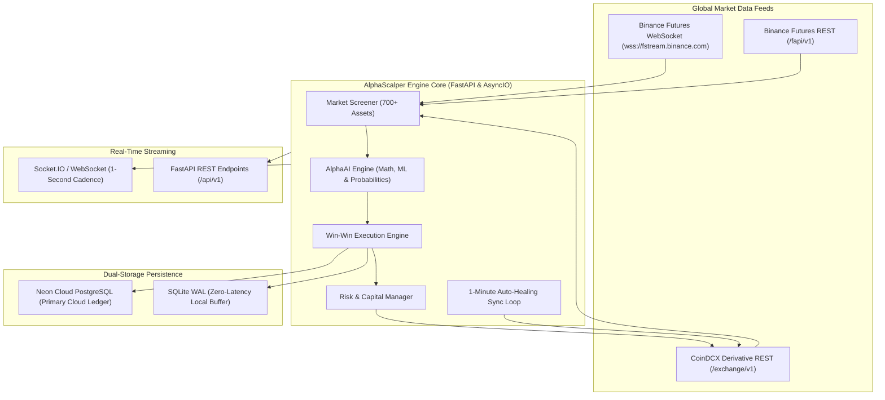
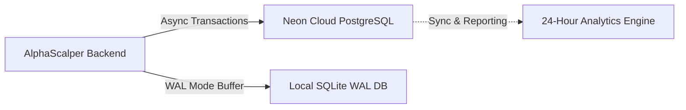

# ⚡ AlphaScalper Backend: Institutional AI Crypto Futures & Scalping Engine

> **High-frequency algorithmic trading system designed for Perpetual Futures (Binance & CoinDCX) with Multi-Timeframe AI screening, Order Book Imbalance (OBI) analytics, automated capital protection, and dual-currency (INR / USDT) accounting.**

---

## 📑 Table of Contents
- [System Architecture](#-system-architecture)
- [Core AI Engine & Mathematical Formulas](#-core-ai-engine--mathematical-formulas)
  - [1. Multi-Timeframe Trend (EMA Filter)](#1-multi-timeframe-trend-ema-filter)
  - [2. Bollinger Band Volatility & Squeeze](#2-bollinger-band-volatility--squeeze)
  - [3. Order Book Imbalance (OBI)](#3-order-book-imbalance-obi)
  - [4. Taker Buy/Sell Delta Volume](#4-taker-buysell-delta-volume)
  - [5. Expected Value (EV) Scoring](#5-expected-value-ev-scoring)
  - [6. Win-Win Bracket Scalping Strategy](#6-win-win-bracket-scalping-strategy)
- [CoinDCX API Integration & Defensive Hardening](#-coindcx-api-integration--defensive-hardening)
  - [Price Tick & Precision Sanitization](#price-tick--precision-sanitization)
  - [Directional Mark Price Clamping](#directional-mark-price-clamping)
  - [Fail-Safe Fallback & Race-Condition Mitigation](#fail-safe-fallback--race-condition-mitigation)
  - [1-Minute Auto-Healing Reconciliation Worker](#1-minute-auto-healing-reconciliation-worker)
- [Dual-Currency System (INR / USDT)](#-dual-currency-system-inr--usdt)
- [Dual-Database Architecture (Neon Cloud PostgreSQL & SQLite WAL)](#-dual-database-architecture)
- [Institutional Risk Management Framework](#-institutional-risk-management-framework)
- [REST API Endpoints & WebSocket Protocol](#-rest-api-endpoints--websocket-protocol)
- [Project Directory Structure](#-project-directory-structure)
- [Installation & Getting Started](#-installation--getting-started)
- [Configuration (.env)](#-configuration-env)
- [Verification & Test Suite](#-verification--test-suite)
- [License & Disclaimer](#-license--disclaimer)

---

## 🏗️ System Architecture



---

## 🧠 Core AI Engine & Mathematical Formulas

The engine combines multi-factor statistical models, order book micro-structure, volume delta, and expected value theory to evaluate over 700+ futures pairs.

### 1. Multi-Timeframe Trend (EMA Filter)
For each asset across 1m, 5m, and 15m intervals:
The Exponential Moving Average (EMA) with smoothing multiplier $\alpha$:
$$\alpha = \frac{2}{N + 1}$$
$$EMA_t = (\text{Price}_t \times \alpha) + (EMA_{t-1} \times (1 - \alpha))$$
- **Fast EMA:** $N = 9$
- **Slow EMA:** $N = 21$
- **Baseline Trend EMA:** $N = 50$

A directional bias requires alignment across timeframes:
$$\text{Bullish Alignment}: EMA_9(1m) > EMA_{21}(1m) \quad \text{AND} \quad \text{Price} > EMA_{50}(5m)$$

### 2. Bollinger Band Volatility & Squeeze
Used to identify breakout regimes from low-volatility compression:
$$\mu = \frac{1}{K} \sum_{i=1}^{K} \text{Close}_i, \quad \sigma = \sqrt{\frac{1}{K} \sum_{i=1}^{K} (\text{Close}_i - \mu)^2}$$
$$\text{Upper Band} = \mu + 2\sigma, \quad \text{Lower Band} = \mu - 2\sigma$$
$$\text{Bandwidth \%} = \frac{\text{Upper Band} - \text{Lower Band}}{\mu} \times 100$$
- If $\text{Bandwidth \%} < \text{Threshold}_{\text{squeeze}}$, the regime is classified as `CHOP_COMPRESSION`.
- When price breaks above Upper Band with volume expansion, regime transitions to `VOLATILITY_EXPANSION_LONG`.

### 3. Order Book Imbalance (OBI)
Calculates real-time buying vs. selling pressure from Level 2 orderbook depth:
$$OBI = \frac{\sum_{i=1}^{D} V_{\text{bid}, i} - \sum_{i=1}^{D} V_{\text{ask}, i}}{\sum_{i=1}^{D} V_{\text{bid}, i} + \sum_{i=1}^{D} V_{\text{ask}, i}}$$
Where:
- $V_{\text{bid}, i}$ and $V_{\text{ask}, i}$ are the cumulative volumes at depth level $i$ (up to depth $D = 10$).
- $OBI \in [-1.0, +1.0]$. An $OBI > +0.25$ indicates significant institutional bid dominance.

### 4. Taker Buy/Sell Delta Volume
Extracts institutional aggression by computing the net delta between market taker buyers and taker sellers:
$$\Delta V = V_{\text{taker\_buy}} - V_{\text{taker\_sell}}$$
$$\Delta V_{\text{ratio}} = \frac{\Delta V}{V_{\text{total}}}$$
A breakout accompanied by $\Delta V_{\text{ratio}} > 0.30$ confirms authentic volume backing.

### 5. Expected Value (EV) Scoring
Signals are scored before execution using probability theory:
$$\mathbb{E}[V] = (P_{\text{win}} \times R_{\text{reward}}) - ((1 - P_{\text{win}}) \times R_{\text{risk}})$$
Where:
- $P_{\text{win}}$ is the composite model win probability (0.0 to 1.0) derived from orderbook imbalance, MTF alignment, and volume delta.
- $R_{\text{reward}}$ is the Take-Profit percentage ($+0.85\%$ to $+1.85\%$).
- $R_{\text{risk}}$ is the Stop-Loss percentage ($-0.45\%$).
- Only candidates with $\mathbb{E}[V] > 0.25\%$ and $P_{\text{win}} \ge 62.0\%$ are approved for automated execution.

### 6. Win-Win Bracket Scalping Strategy
Designed to maximize win rates and eliminate giveback risk:

```
 Entry Price (100%)
      │
      ├───────────────────────► [+0.85%] TP1 Hit: Exit 50% Position
      │                                    │
      │                                    ▼
      │                         RATCHET STOP LOSS TO BREAKEVEN (+0.08% Fee Buffer)
      │                         [TRADE IS NOW 100% RISK-FREE]
      │                                    │
      │                                    ▼
      ├───────────────────────► [+1.85%] TP2 Hit: Exit Remaining 50% Runner
      │
      ▼
 [-0.45%] Hard Stop Loss (Max Risk Capped)
```

1. **Tier 1 Entry:** Order executes with contract-sanitized safe quantity.
2. **TP1 Target (+0.85%):** Automatically closes **50% of the position** to secure guaranteed profit.
3. **Breakeven Ratchet:** The instant TP1 fills, the Stop Loss is immediately ratcheted to **Entry Price + 0.08% Fee Buffer**. The trade is now mathematically risk-free.
4. **TP2 Runner Target (+1.85%):** The remaining 50% rides the trend to maximum profit.
5. **Smart Scale-Out Guard:** If 50% notional is less than CoinDCX's minimum order rule ($6.00 USDT), the engine retains 100% of the position on the exchange while ratcheting the Stop-Loss to Breakeven (+Fees) to prevent orphan contract rejections.

---

## 🛡️ CoinDCX API Integration & Defensive Hardening

CoinDCX futures endpoints require strict adherence to price precision, order rules, and mark price boundaries. The backend includes an institutional-grade protective layer:

### Price Tick & Precision Sanitization
- **The Problem:** Micro-cap altcoins (e.g. PEPE, SHIB) trade at 8–10 decimal places (`$0.00000845`). Standard Python `round(..., 6)` truncates or zeros out the price, or formats in scientific notation (`8.45e-6`), which CoinDCX rejects with HTTP 400. High-priced coins (BTC, ETH) reject if extra decimals beyond their tick size (`0.1`) are sent.
- **The Solution:** `sanitize_price_by_instrument()` in `coindcx_client.py` queries live contract rules and applies dynamic quantization:
  $$\text{Steps} = \text{round}\left(\frac{\text{Price}}{\text{Tick Size}}\right)$$
  $$\text{Quantized Price} = \text{Steps} \times \text{Tick Size}$$
  Formatted explicitly with fixed-point string templates (`f"{quantized:.{precision}f}"`) with zero scientific notation.

### Directional Mark Price Clamping
CoinDCX derivative engines strictly validate stop trigger placement against live mark prices:
- **LONG Positions:** $\text{Take Profit} > \text{Mark Price}$ and $\text{Stop Loss} < \text{Mark Price}$.
- **SHORT Positions:** $\text{Take Profit} < \text{Mark Price}$ and $\text{Stop Loss} > \text{Mark Price}$.
If market volatility crosses the boundary before API transmission, the engine dynamically clamps the trigger with a minimum 0.2% safety buffer, preventing immediate exchange rejection.

### Fail-Safe Fallback & Race-Condition Mitigation
1. **Async Background Attacher (`_background_attach_tpsl`):** If an order is filled but CoinDCX's matching engine has a delayed position registration, the engine does not abort. It spawns a background worker that polls for up to 60 seconds and attaches the bracket triggers the moment the position appears.
2. **Dual-Attempt Fallback:** If CoinDCX rejects a combined TP/SL payload (e.g., due to an exchange TP price band restriction), the engine immediately falls back to submitting the **Stop-Loss individually**, guaranteeing capital preservation is never sacrificed.

### 1-Minute Auto-Healing Reconciliation Worker
Runs continuously in the background every 60 seconds:
- Inspects every open position on CoinDCX.
- Verifies whether active Stop-Loss and Take-Profit orders exist.
- If either is missing (e.g. manual entry or dropped trigger), it calculates algorithmic targets and automatically attaches them to the exchange.

---

## 💱 Dual-Currency System (INR / USDT)

The engine seamlessly bridges international USDT-margined contracts with Indian Rupee (INR) accounts:
- **Auto-Detection:** Automatically queries CoinDCX wallet balances on startup and detects account base currency (`INR` vs `USDT`).
- **Live Settlement Rate:** Queries the authentic exchange settlement rate (`settlement_currency_avg_price`, e.g., ₹89.50 / USDT) to calculate real-time PnL, margin, and drawdown in both currencies simultaneously.
- **Dual Telemetry Broadcast:** Every position, balance, and order metric is broadcast with both `_usdt` and `_inr` fields for the frontend.

---

## 💾 Dual-Database Architecture



### 1. Neon Cloud PostgreSQL (Primary)
- **Engine:** Serverless PostgreSQL via `asyncpg` with connection pooling.
- **Schema:**
  - `trades`: Full lifecycle records (entry, targets, realized PnL, fees paid).
  - `trade_events`: Immutable audit trail for every execution event (`ENTRY`, `TP1_HIT`, `BREAKEVEN_LOCKED`, `TP2_HIT`, `STOP_EXECUTED`).
  - `equity_snapshots`: Periodic portfolio valuation logging for equity curve charting.
  - `ai_signals_log`: Complete log of model evaluations to track historical accuracy.
- **24-Hour Rolling Analytics Engine:** Computes rolling 24h PnL, win rates, profit factor, gross profit, gross loss, and fee expenditure directly in SQL:
  $$\text{Profit Factor} = \frac{\sum \text{Gains}_{24h}}{\sum |\text{Losses}_{24h}|}$$

### 2. SQLite with Write-Ahead Logging (WAL) (Fallback Buffer)
- Local zero-latency persistence. If internet drops or Neon has temporary connection resets, trades are buffered locally without halting the trading loop.

---

## 🛑 Institutional Risk Management Framework

1. **24-Hour Dynamic Circuit Breaker:**
   - Tracks rolling net loss over 24 hours.
   - If loss reaches the daily cap (default: **-4.0%** of portfolio equity), the circuit breaker trips: all active autopilot loops pause immediately.
2. **20% Maximum Margin Allocation Cap:**
   - Single-trade margin is hard-capped at **20% of usable wallet equity**, preventing over-concentration in any single coin.
3. **Emergency Global Kill Switch:**
   - An authenticated single-call safety switch that instantly cancels all open orders across CoinDCX futures and liquidates all positions at market price.

---

## 🔌 REST API Endpoints & WebSocket Protocol

### Core REST Endpoints
| Method | Endpoint | Description |
|---|---|---|
| `GET` | `/health` | System health, uptime, database status, and exchange connectivity |
| `GET` | `/api/v1/telemetry/full` | Complete real-time engine telemetry snapshot |
| `GET` | `/api/v1/screener/top-ranked` | Filtered top-10 AI ranked trading targets |
| `GET` | `/api/v1/positions` | Active futures positions with unrealized PnL (INR & USDT) |
| `GET` | `/api/v1/orders/active` | Active and untriggered open trigger orders |
| `POST` | `/api/v1/orders/execute` | Manual order placement with auto-quantized TP/SL triggers |
| `POST` | `/api/v1/positions/exit` | Instant market exit and cancel triggers for a position |
| `POST` | `/api/v1/engine/start` | Start autonomous autopilot scalping with specified leverage |
| `POST` | `/api/v1/engine/stop` | Pause autonomous autopilot execution |
| `POST` | `/api/v1/engine/kill-switch` | Emergency liquidation and complete order cancellation |
| `GET` | `/api/v1/stats/analytics` | Rolling 24-hour performance metrics and hit rates from Neon DB |
| `GET` | `/api/v1/trades/history` | Historical completed trades list |

### WebSocket / Socket.IO Events
- `telemetry_update`: Broadcast every second with active candidate metrics, account balance, and win rates.
- `positions_update`: Pushed whenever open positions change or are reconciled.
- `orders_update`: Pushed on trigger placement, fills, or cancellations.
- `execution_event`: Instant audit notification on trade events (`ENTRY`, `TP1_HIT`, `BREAKEVEN_LOCKED`, `AUTO_HEALED`).

---

## 📁 Project Directory Structure

```
AI_sacpler_backend/
├── ai_engine.py           # Multi-Factor AI evaluation, scoring & EV models
├── binance_client.py      # Binance Futures REST & WebSocket data client
├── coindcx_client.py      # CoinDCX HMAC-SHA256 authenticated execution client
├── config.py              # Pydantic environment settings & parameters
├── db.py                  # Dual Neon PostgreSQL & SQLite WAL persistence
├── market_screener.py     # 700+ asset universe scanner & regime detection
├── risk_manager.py        # Circuit breaker, margin caps & balance guards
├── server.py              # FastAPI application, background tasks & WebSockets
├── win_win_strategy.py    # Win-Win Bracket Scalp state machine & execution
├── requirements.txt       # Python dependencies
├── .env.example           # Environment template (DO NOT COMMIT REAL KEYS)
└── .gitignore             # Git ignore configuration
```

---

## 🚀 Installation & Getting Started

### Prerequisites
- **Python 3.11+** (Python 3.12 recommended)
- **CoinDCX Account** with API Key & Secret (Futures Trading enabled)
- *(Optional)* **Neon Cloud PostgreSQL Account** (free tier available at [neon.tech](https://neon.tech))

### 1. Clone & Set Up Virtual Environment
```bash
git clone https://github.com/your-username/AI_sacpler_backend.git
cd AI_sacpler_backend

# Create virtual environment
python3 -m venv .venv
source .venv/bin/activate

# Install dependencies
pip install --upgrade pip
pip install -r requirements.txt
```

### 2. Configure Environment Variables
Copy `.env.example` to `.env` and fill in your API credentials:
```bash
cp .env.example .env
nano .env
```

### 3. Run in Paper Mode (Safe Simulation)
```bash
# Set TRADING_MODE=PAPER in .env, then start the server:
uvicorn server:app --host 0.0.0.0 --port 8000 --reload
```

### 4. Run in Live Exchange Mode
```bash
# Ensure TRADING_MODE=LIVE in .env with valid CoinDCX API credentials:
uvicorn server:app --host 0.0.0.0 --port 8000
```
API Documentation will be available at: `http://localhost:8000/docs`.

---

## ⚙️ Configuration (.env)

| Variable | Default | Description |
|---|---|---|
| `TRADING_MODE` | `PAPER` | `PAPER` for simulation, `LIVE` for real execution |
| `MARGIN_CURRENCY` | `INR` | Base margin currency: `INR` or `USDT` |
| `COINDCX_API_KEY` | - | CoinDCX API Key with Futures Trade permissions |
| `COINDCX_API_SECRET` | - | CoinDCX HMAC-SHA256 API Secret |
| `NEON_DATABASE_URL` | - | PostgreSQL connection URL from Neon.tech |
| `ENABLE_NEON_CLOUD` | `True` | Enable cloud PostgreSQL sync (falls back to SQLite if unreachable) |
| `DEFAULT_LEVERAGE` | `15.0` | Default leverage multiplier (1x to 50x) |
| `TP1_RATIO` | `0.0085` | Tier 1 Take-Profit target (+0.85%) |
| `TP2_RATIO` | `0.0185` | Tier 2 Runner target (+1.85%) |
| `HARD_SL_RATIO` | `0.0045` | Hard Stop-Loss ratio (-0.45%) |
| `DAILY_LOSS_LIMIT_PCT` | `0.04` | 24-Hour Circuit Breaker loss cap (-4.0%) |

---

## 🧪 Verification & Test Suite

The repository includes standalone validation test scripts:
```bash
# Test TP/SL tick precision, scientific notation & directional safety:
python scratch/test_tpsl_precision_and_attachment.py

# Test platform risk management & 1-minute auto-healing:
python scratch/test_tpsl_auto_heal_and_risk.py

# Test core platform integration:
python scratch/test_hardened_platform.py
```

---

## 📜 License & Disclaimer

### Disclaimer
> **HIGH RISK WARNING:** Cryptocurrency perpetual futures trading carries substantial risk and can result in the loss of your entire capital. This software is for educational and research purposes. Test thoroughly in `PAPER` mode before committing real capital. The authors assume no liability for financial losses.

### License
Distributed under the **MIT License**.